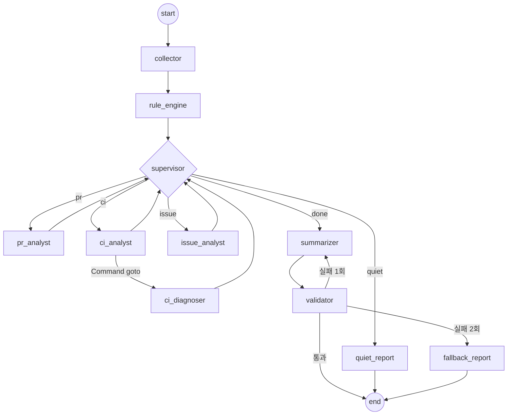

# 에이전트 설계서 — Team Project PM Agent

> 그래프 구성, 에이전트별 입력·출력 계약, 프롬프트, 실패 처리를 정의합니다.
> 관련 문서: [DATA_SPEC](DATA_SPEC.md) · [TEST_PLAN](TEST_PLAN.md)
> 전제: LangGraph `StateGraph` + `Command`, LLM은 `with_structured_output(Pydantic)`으로 호출 (공급자는 미정)

## 1. 그래프



| 노드 | 종류 | LLM | 과정 |
|---|---|---|---|
| `collector` | 함수 | ✗ | 09 |
| `rule_engine` | 함수 (`rules.py`) | ✗ | — |
| `supervisor` | 라우터 | ✗ (규칙 기반) | 03 |
| `pr_analyst` / `issue_analyst` / `ci_analyst` | 워커 Agent | ✓ | 03 |
| `ci_diagnoser` | 전문 Agent (확장) | ✓ | 05 |
| `summarizer` | 워커 Agent | ✓ | — |
| `validator` | 함수 | ✗ | — |
| `quiet_report` / `fallback_report` | 함수 (템플릿) | ✗ | — |

> **왜 Supervisor에 LLM을 쓰지 않나?** 라우팅 기준(어느 영역에 변화가 있나)이 데이터로 명확히 정해지므로, 규칙으로 처리하면 비용 없이 항상 같은 결과가 나옵니다. 발표에서 "LLM을 쓸 곳과 쓰지 않을 곳을 나눈 설계"로 설명합니다.

## 2. State

```python
class PMState(TypedDict):
    config: Config
    raw: RawActivity
    candidates: list[RiskCandidate]            # rule_engine 결과
    digests: dict[str, MemberDigest]           # rule_engine이 함께 계산
    todo_areas: list[Literal["pr", "ci", "issue"]]
    done_areas: Annotated[list[str], operator.add]
    findings: Annotated[list[Finding], operator.add]
    diagnosis: Diagnosis | None
    report: Report | None
    report_md: str
    validation_errors: list[str]
    attempts: int                              # summarizer 재시도 횟수
    hops: int                                  # supervisor 방문 횟수
```

### 공통 타입

```python
Severity = Literal["critical", "high", "medium", "low"]

class RiskCandidate(BaseModel):     # 규칙이 만든 후보 (LLM 이전)
    rule_id: str                    # "R-PR-STALE" 등, TEST_PLAN과 동일
    area: Literal["pr", "ci", "issue"]
    severity: Severity
    refs: list[str]                 # DATA_SPEC 6장 ref 형식
    facts: dict                     # {"hours_without_review": 52, ...}

class Finding(BaseModel):           # 분석 Agent의 출력 단위
    rule_id: str                    # 반드시 candidates 중 하나
    area: Literal["pr", "ci", "issue"]
    severity: Severity
    title: str                      # 한 줄 요약, 60자 이내
    explanation: str                # 원인 추정·영향, 2문장 이내
    suggested_action: str           # 누가 무엇을 하면 되는지, 1문장
    owner: str | None               # 팀원 key
    refs: list[str]
```

## 3. Supervisor (03)

```python
def supervisor(state) -> Command:
    if state["hops"] >= 6:
        return Command(goto="summarizer")
    changed = areas_with_activity(state["raw"], state["candidates"])
    if not changed and not state["candidates"]:
        return Command(goto="quiet_report")
    remaining = [a for a in changed if a not in state["done_areas"]]
    if not remaining:
        return Command(goto="summarizer")
    return Command(goto=f"{remaining[0]}_analyst",
                   update={"hops": state["hops"] + 1})
```

- `areas_with_activity`: PR 생성·갱신·리뷰가 있으면 `pr`, 실패한 CI 실행이 있으면 `ci`, 이슈 변경이 있거나 이슈 관련 후보가 있으면 `issue`로 판단합니다.
- 우선순위: `ci` → `pr` → `issue` (main 빌드 실패가 가장 급하므로).

## 4. 분석 Agent 공통 계약

| 항목 | 내용 |
|---|---|
| 입력 | 담당 영역의 `candidates` + 관련 `raw` 부분집합(해당 ref의 제목·시각·로그 조각만) |
| 출력 | `list[Finding]` (structured output) |
| 규칙 | ① 후보마다 **정확히 하나의** Finding을 만든다. ② 새 `rule_id`나 새 `ref`를 만들지 않는다. ③ 심각도는 규칙이 정한 값을 **한 단계까지만** 올리거나 내릴 수 있고, 그 이유를 explanation에 쓴다. |
| 종료 | `done_areas`에 자기 영역 추가 → supervisor로 복귀 |

### 4.1 `pr_analyst`
- 추가 입력: PR 제목, 작성자, 리뷰 요청자, 마지막 활동 시각, 변경 파일 수
- 판단 포인트: 리뷰어가 지정됐는데 응답이 없는지, 리뷰어 지정 자체가 없는지 → `suggested_action`을 다르게 작성

### 4.2 `issue_analyst`
- 추가 입력: 이슈 제목, 라벨, 담당자, 연결된 커밋·PR
- 판단 포인트: 막힌 작업이 다른 PR 리뷰 대기 때문인지(연결된 Draft/오픈 PR 존재) 확인

### 4.3 `ci_analyst` + Handoff (05)
- 추가 입력: 실패한 job 이름, `failed_step`, `failed_tests`, 로그 마지막 50줄
- **Handoff 조건**: `R-CI-REPEAT`(같은 테스트 5회 중 3회 이상 실패) 또는 `R-CI-FLAKY` 후보가 있을 때

```python
if needs_diagnosis(candidates):
    return Command(goto="ci_diagnoser",
                   update={"findings": findings,
                           "handoff_payload": build_payload(candidates, raw)})
```

- `handoff_payload`에는 해당 테스트의 로그 조각(실행당 최대 80줄), 관련 커밋 SHA와 메시지만 담습니다. 전체 state를 넘기지 않아 컨텍스트를 작게 유지합니다.

### 4.4 `ci_diagnoser` (확장)

```python
class Diagnosis(BaseModel):
    test: str
    pattern: Literal["flaky", "regression", "env", "unknown"]
    hypothesis: str          # 원인 가설, 2문장 이내
    evidence_lines: list[str]  # 로그에서 그대로 인용한 줄 (최대 5줄)
    suspect_commit: str | None # "commit:a1b2c3d"
    next_step: str
```

- `evidence_lines`는 입력 로그에 **글자 그대로 있는 줄**이어야 합니다(validator가 확인).

## 5. `summarizer`

```python
class MemberSection(BaseModel):
    member: str
    yesterday: list[str]     # 각 줄 끝에 [ref] 표기, 예: "로그인 API PR 머지 [pr:35]"
    today: list[str]
    note: str | None         # "데이터 없음" 등

class Report(BaseModel):
    date: str                # KST YYYY-MM-DD (요일)
    risks: list[Finding]     # findings 그대로, 심각도 순 정렬
    members: list[MemberSection]
    stats: dict[str, int | float]   # 코드로 계산, LLM이 만들지 않음
    headline: str            # 오늘의 한 줄 요약, 80자 이내
```

- LLM이 작성하는 부분은 `members`의 문장 다듬기와 `headline`뿐입니다. `risks`와 `stats`는 코드가 그대로 채웁니다.
- 마크다운 렌더링(`report_md`)은 Jinja2 템플릿이 담당합니다. LLM이 마크다운을 직접 만들지 않습니다.

### 프롬프트 뼈대 (`prompts/summarizer.md`)

```
너는 4인 개발팀의 스크럼 마스터다.
아래 EVIDENCE는 팀원별 근거 목록이다. 이 목록에 있는 항목만 사용해서
각 팀원의 "어제 한 일"과 "오늘 할 일"을 한국어 한 줄씩으로 요약하라.

규칙:
- EVIDENCE에 없는 작업을 추측하거나 만들지 마라.
- 각 줄 끝에 근거 ref를 [pr:35] 형식으로 반드시 붙여라.
- 같은 PR·이슈에 대한 여러 커밋은 한 줄로 합쳐라.
- 근거가 없는 팀원은 note에 "데이터 없음"이라고만 써라.
- headline은 가장 심각한 위험 한 가지를 중심으로 80자 이내로 써라.

EVIDENCE:
{digests_json}

RISKS:
{findings_json}
```

## 6. `validator` (할루시네이션 방지)

| 검사 | 실패 시 |
|---|---|
| V1. Report가 스키마에 맞는가 | 재시도 |
| V2. 모든 `[ref]`가 `RawActivity`에 존재하는가 | 해당 줄 삭제 후 재시도 요청 |
| V3. 모든 `candidates`가 `risks`에 하나씩 있는가 (누락 0) | 재시도 |
| V4. 모든 팀원 섹션이 있는가 | 재시도 |
| V5. `Diagnosis.evidence_lines`가 로그에 그대로 있는가 | 진단 결과 제외 |
| V6. 이메일 주소 패턴이 들어 있지 않은가 | 마스킹 |

- 재시도할 때는 `validation_errors`를 프롬프트에 붙여서 무엇이 틀렸는지 알려 줍니다.
- 2회 실패하면 `fallback_report`: 규칙 결과와 근거 목록만으로 템플릿 리포트를 만들고 상단에 "⚠️ 자동 요약 실패, 원본 데이터 기반 리포트"라고 표시합니다(NFR-05).

## 7. 오류 처리

| 상황 | 처리 |
|---|---|
| GitHub API 403/429 (한도 초과) | `Retry-After` 또는 `x-ratelimit-reset`까지 대기, 최대 1회 |
| GitHub API 5xx | 지수 백오프 3회 |
| 로그 다운로드 실패 | `log_tail=""`, `failed_tests=[]`로 진행 |
| LLM 호출 실패·타임아웃 | 재시도 2회 → 해당 Agent는 후보를 그대로 Finding으로 변환(설명 없이) |
| 그래프 전체 예외 | job 실패 처리 → publish job이 실행되지 않음 → 운영자가 Actions 알림으로 확인 |

## 8. 로깅 (발표 시연용)

- 각 노드 시작과 끝에 `::group::[supervisor] → ci_analyst` 형식으로 출력해서 Actions 로그에서 흐름을 접었다 폈다 볼 수 있게 합니다.
- 노드별 LLM 토큰 사용량을 마지막에 표로 출력합니다(NFR-02 확인용).
