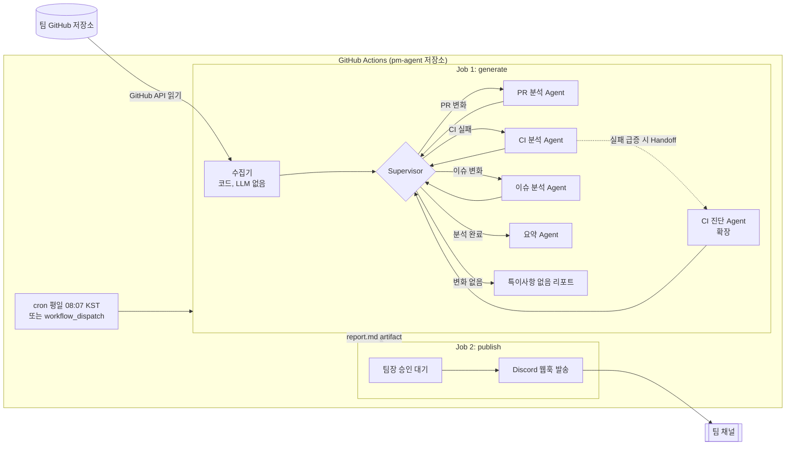

# 팀 프로젝트 PM 에이전트 — 계획서

> 저장소: [haedeuncha/team-pm-agent](https://github.com/haedeuncha/team-pm-agent) (public, 팀 저장소를 읽기 전용 PAT로 조회)
> 08 멀티 에이전트 미니 프로젝트 · 작성일 2026-09-29
> 세부 문서: [REQUIREMENTS](REQUIREMENTS.md) · [DATA_SPEC](DATA_SPEC.md) · [AGENTS](AGENTS.md) · [TEST_PLAN](TEST_PLAN.md) · [OPERATIONS](OPERATIONS.md)
> 적용 과정: 09 GitHub Actions · 03 Supervisor · 05 Handoff · 06 발송 승인

---

## 1. 한 줄 요약

매일 아침 GitHub Actions가 팀 저장소의 커밋·PR·이슈·CI 기록을 모으고, 멀티 에이전트가 **팀원별 어제 한 일 / 오늘 할 일 / 위험 요소**를 정리합니다. **팀장이 승인하면** 팀 채널로 데일리 리포트를 보냅니다.

## 2. 목표와 범위

### 2.1 목표
1. 4인 팀 프로젝트에서 실제로 매일 쓰는 스크럼 보조 도구를 만든다.
2. CI/CD를 배포 도구가 아니라 **운영 자동화 도구**로 활용하는 사례를 보여 준다.
3. Supervisor, Handoff, Human-in-the-loop 패턴을 하나의 흐름 안에서 모두 사용한다.

### 2.2 범위

| 구분 | 포함 내용 |
|---|---|
| **MVP (필수)** | 수집(코드) → Supervisor → PR·CI·이슈 분석 → 요약 → 승인 → Discord 발송, cron 실행과 수동 실행 |
| **확장 (여유 있을 때)** | CI 진단 Agent로 Handoff, 주간 모드(`--since 7d`), LangGraph interrupt 방식 승인, 리포트 기록 누적 |
| **제외** | 대시보드 웹 UI, 팀원 계획 입력 폼, 여러 저장소 동시 분석 |

## 3. 전체 아키텍처



**구성 원칙**
- **pm-agent는 별도 저장소로 만듭니다.** 팀 저장소에 워크플로를 섞지 않아야 하고, 읽기 전용 토큰으로 권한을 제한할 수 있습니다.
- **수집은 코드, 판단은 LLM이 맡습니다.** 결정론적인 작업에 LLM을 쓰지 않아서 비용과 흔들림을 줄입니다.
- **규칙으로 먼저 거르고 LLM으로 해석합니다.** 위험 후보는 규칙으로 골라내고, LLM은 원인 추정과 문장화만 담당합니다.

## 4. 에이전트 설계

| 노드 | 종류 | 입력 | 출력 | LLM |
|---|---|---|---|---|
| `collector` | 함수 노드 | 저장소, 기간 | `raw`: commits, prs, issues, ci_runs | ✗ |
| `supervisor` | 라우터 (규칙 기반) | 위험 후보, 완료된 분석 목록 | 다음 노드 이름 (`Command(goto=...)`) | ✗ |
| `pr_analyst` | 워커 Agent | 열린 PR, 리뷰 기록 | `findings.pr` | ✓ |
| `ci_analyst` | 워커 Agent | 워크플로 실행 기록, 실패 job 로그 요약 | `findings`, Handoff 여부를 **스스로 판단** | ✓ |
| `issue_analyst` | 워커 Agent | 이슈, 담당자, 연결된 커밋 | `findings.issue` | ✓ |
| `ci_diagnoser` *(확장)* | 전문 Agent | 반복 실패 테스트 로그 | 원인 가설, 재현 방법 | ✓ |
| `summarizer` | 워커 Agent | 팀원별 근거, `findings` 전체 | `report` (검증 후 `report_md`) | ✓ |
| `validator` | 함수 | `report`, 근거 | 통과 / 재시도 / fallback | ✗ |

### 4.1 Supervisor 라우팅 규칙 (03)
1. 분석할 영역 = 규칙 엔진이 **위험 후보를 찾은 영역**만 고릅니다. 후보가 없는 영역에 LLM을 부르지 않습니다.
2. 이미 분석을 끝낸 영역은 건너뜁니다. 순서는 `ci` → `pr` → `issue`입니다.
3. 남은 영역이 없으면 `summarizer`로, 변화도 후보도 전혀 없으면 `quiet_report`로 보냅니다.
4. 무한 루프를 막기 위해 최대 방문 횟수(`max_hops`, 기본 6회)를 둡니다.

### 4.2 Handoff (05)
- `ci_analyst`(LLM)는 반복 실패(`R-CI-REPEAT`)나 flaky(`R-CI-FLAKY`) 후보를 보고 **진단 에이전트에게 넘길지 스스로 판단**합니다(`handoff_to_diagnoser`).
- 넘기기로 하면 `Command(goto="ci_diagnoser", update={...})`로 이동합니다. 넘길 대상 테스트가 없으면 코드가 막습니다.
- 넘길 때는 해당 테스트의 로그 조각(실행당 80줄)과 커밋 목록만 전달해서 컨텍스트를 작게 유지합니다.
- 진단이 끝나면 Supervisor로 돌아갑니다.

### 4.3 State
세부 스키마는 [AGENTS.md 2장](AGENTS.md#2-state)과 `pm_agent/state.py`가 기준입니다.

## 5. 분석 규칙 (위험 요소 판정 기준)

| 위험 유형 | 판정 규칙 | 심각도 |
|---|---|---|
| 오래된 PR | 리뷰 없이 **48시간 이상** 열려 있음 | 중 |
| 방치된 PR | 마지막 활동 후 **5일 이상** 지남 | 상 |
| 막힌 작업 | 할당된 이슈인데 **3일 이상** 연결된 커밋이 없음 | 중 |
| 담당자 없는 이슈 | `bug` 라벨인데 담당자가 없음 | 중 |
| 반복 실패 테스트 | 최근 5회 중 **3회 이상** 실패 | 상 |
| Flaky 테스트 | **같은 커밋 SHA**에서 성공과 실패가 모두 있음 | 중 |
| main 빌드 깨짐 | 기본 브랜치의 마지막 CI가 실패 | 최상 |

> 임계값은 `config.yaml`에서 조정할 수 있게 둡니다.

### "어제 한 일 / 오늘 할 일" 근거
- **어제 한 일**: 해당 팀원의 커밋, 머지된 PR, 닫은 이슈, 남긴 리뷰
- **오늘 할 일**: 본인에게 할당된 열린 이슈, 리뷰를 요청받은 PR, 본인의 Draft PR
- LLM에는 **근거 목록 안에서만 쓰라**고 지시하고, 항목마다 링크를 붙입니다. 근거가 없으면 "데이터 없음"으로 표시합니다(할루시네이션 방지).

## 6. 발송 승인 설계 (06)

### 6.1 MVP: GitHub Environment Required reviewers
```yaml
publish:
  needs: generate
  environment: daily-report   # Required reviewers = 팀장
  steps:
    - uses: actions/download-artifact@v4
    - run: python -m pm_agent.publish report.md
```
- 팀장은 GitHub 알림 → Actions 화면에서 리포트 미리보기(Job Summary)를 보고 **Approve / Reject**를 누릅니다.
- 서버나 DB 없이도 사람 승인 단계를 만들 수 있습니다.
- **승인 마감**: `config.yaml`의 `approval_deadline_kst`(기본 12:00)까지 승인되지 않으면 publish가 발송하지 않고 끝납니다. 오후에 도착하는 "어제 리포트"를 막기 위해서입니다.
- ✅ team-pm-agent는 **public** 저장소라 Environment 보호 규칙을 쓸 수 있습니다(시크릿은 public이어도 노출되지 않음). 설정이 막히면 아래 대안을 씁니다.

### 6.2 대안: 이슈 코멘트 승인 (어떤 요금제에서도 동작)
1. generate job이 리포트 초안을 **이슈로 등록**하고 팀장을 멘션합니다.
2. 팀장이 `/approve` 또는 `/edit <수정 내용>`을 코멘트로 남깁니다.
3. `issue_comment` 이벤트 워크플로가 작성자가 팀장인지 확인한 뒤 발송하고 이슈를 닫습니다.

### 6.3 확장: LangGraph `interrupt` 방식
- 체크포인터(SQLite/Supabase)와 Discord 버튼 콜백 서버가 필요합니다.
- 발표에서 "Actions 네이티브 승인과 그래프 내부 승인" 비교 슬라이드로 활용합니다.

## 7. GitHub Actions 워크플로 (09)

파일: [`.github/workflows/daily-scrum.yml`](../.github/workflows/daily-scrum.yml), [`.github/workflows/ci.yml`](../.github/workflows/ci.yml)

| 항목 | 내용 |
|---|---|
| 스케줄 | `7 23 * * 0-4` = KST 월~금 08:07 (정각을 피해 지연 방지) |
| 수동 실행 입력 | `since`(1d/7d), `fixture`(가상 팀 시연), `dry_run`(테스트 채널로 발송, 기본 true) |
| generate job | 수집 → 그래프 실행 → `report.md`를 Job Summary에 표시 → artifact 업로드 |
| publish job | `environment: daily-report` 승인 대기 → 승인 마감 확인 → Discord 발송 |
| ci.yml | push마다 테스트 145개(커버리지 95% 미만이면 실패) + fixture 5종 데모 실행 (API 키 불필요) |

**Secrets / Variables**: 인증(GitHub App/PAT), LLM 키, 채널별 비밀값 목록은 [OPERATIONS.md 3·4장](OPERATIONS.md)에 있습니다. 채널 비밀값은 워크플로가 `SECRETS_JSON`으로 넘기므로 `config.yaml`에 채널을 추가해도 워크플로를 고칠 필요가 없습니다.

## 8. 리포트 예시

가상 팀(해든·민수·지우·서연, `demo-team/campus-market`)으로 만든 실제 출력입니다.

| 시나리오 | 실행 경로 | 결과 |
|---|---|---|
| [normal_day](../examples/normal_day.md) | supervisor → pr_analyst → summarizer | 리뷰 대기 PR 1건 |
| [risky_day](../examples/risky_day.md) | pr_analyst → issue_analyst → summarizer | 방치 PR, 막힌 이슈, 담당자 없는 버그 등 4건 |
| [ci_flaky](../examples/ci_flaky.md) | ci_analyst → **ci_diagnoser (Handoff)** → summarizer | main 빌드 실패, 반복 실패, flaky + 진단 |
| [quiet_day](../examples/quiet_day.md) | supervisor → quiet_report | 특이사항 없음 |
| [monday](../examples/monday.md) | supervisor → summarizer | 금~월 72시간 범위 |

## 9. 폴더 구조

```
team-pm-agent/
├─ .github/workflows/
│  ├─ daily-scrum.yml       # 근무일 확인 + 생성 + 승인 + 발송 + 실패 알림
│  └─ ci.yml                # push 마다 테스트 (커버리지 95% 미만 실패)
├─ pm_agent/
│  ├─ run.py                # 진입점: 그래프 실행 → report.md / report.json
│  ├─ publish.py            # 승인 마감·중복 확인 → 채널 발송 → 기록
│  ├─ alert.py              # 실패 알림
│  ├─ graph.py              # StateGraph 조립, ::group:: 로깅
│  ├─ state.py · models.py · config.py
│  ├─ collector/            # github.py(API, 여러 저장소), auth.py(GitHub App), normalize.py, window.py, logparse.py
│  ├─ rules.py              # 판정 규칙 + 팀원별 근거 + 통계 (LLM 없음)
│  ├─ llm.py                # FakeLLM(오프라인) / LangChainLLM(OpenAI·Anthropic), 비용 추정
│  ├─ agents/               # supervisor.py, analysts.py(PR·이슈·CI·진단), summarizer.py(요약·검증·템플릿)
│  ├─ security.py           # 비밀값 가리기, 프롬프트 인젝션 완화
│  ├─ notify.py             # Discord / Slack / Teams / 메일(SMTP·Gmail)
│  ├─ store.py              # 상태 저장소 (none / local / github 브랜치)
│  ├─ workcalendar.py       # 주말·공휴일
│  ├─ credentials.py        # 비밀값 읽기 (환경 변수 → SECRETS_JSON)
│  ├─ prompts/*.md · templates/report.md.j2 · render.py
├─ fixtures/ · examples/ · scripts/make_fixtures.py
├─ tests/                   # 145개 테스트, 커버리지 99%
├─ config.yaml              # 팀·저장소·팀원·임계값·채널·근무일·보안
├─ Dockerfile · .env.example
└─ requirements.txt · requirements-llm.txt
```

## 10. 일정 (7단계)

| 단계 | 작업 | 산출물 | 과정 |
|---|---|---|---|
| D1 | 저장소 생성, 토큰·시크릿 설정, 수집기 작성 후 실제 응답을 `fixtures/`로 저장 | `collector`, fixtures | 09 |
| D2 | `rules.py` + 단위 테스트 (fixtures 기반) | 위험 후보 목록 | — |
| D3 | 분석 Agent 3개 + Supervisor 라우팅 | 그래프 v1 | 03 |
| D4 | 요약 Agent, 리포트 템플릿, 로컬 end-to-end 실행 | `report.md` | — |
| D5 | Actions 워크플로 + Environment 승인 + Discord 발송 | 첫 자동 발송 | 09·06 |
| D6 | CI 진단 Agent Handoff, 주간 모드 | 확장 기능 | 05 |
| D7 | 실제 팀 저장소에서 운영, 프롬프트 튜닝, 발표 자료 | 시연 영상, 슬라이드 | — |

> 마감일에 맞춰 D6을 빼거나 D1~D2를 합칠 수 있습니다. **D5까지 끝나면 MVP 완성**입니다.

**구현 현황 (2026-09-29)**
- D1~D6 코드는 가상 팀 데이터로 구현·테스트 완료.
- 실무 운영 기능 추가: GitHub App 인증, Slack·Teams·메일(Gmail) 채널, 비밀값 가리기, 프롬프트 인젝션 완화, 공휴일 건너뛰기, 중복 발송 방지·이력, 실패 알림, 여러 저장소, GitHub Enterprise, Docker ([OPERATIONS.md](OPERATIONS.md)).
- 테스트 145개 통과, 커버리지 99%.
- 남은 일: 실제 팀 저장소·LLM·채널 연결 후 `dry_run` 확인, 회사 도입 시 [OPERATIONS 1장](OPERATIONS.md#1-도입-전-체크리스트-회사가-결정할-것) 체크리스트, D7 운영.

## 11. 리스크와 대응

| 리스크 | 영향 | 대응 |
|---|---|---|
| Environment 승인 설정이 막힘 | 06 구현 막힘 | 저장소가 public이라 가능성은 낮음, 막히면 이슈 코멘트 승인(6.2) 사용 |
| 4인 팀이라 하루 활동량이 적음 | 리포트가 빈약함 | 주간 모드, 시연용 7일 데이터 |
| LLM이 없는 일을 지어냄 | 신뢰도 하락 | 근거 목록 안에서만 작성, 항목마다 링크, 근거 없으면 "데이터 없음" |
| 팀원의 git 이메일과 GitHub 계정 불일치 | 팀원별 집계 누락 | `config.yaml`에 login·이메일 매핑 |
| CI 로그가 너무 큼 | 토큰 비용 증가 | 실패 step의 마지막 N줄만 추출 |
| Actions cron 지연·누락 | 발송 시각이 흔들림 | :07분 스케줄, `workflow_dispatch`로 수동 실행 |
| Discord 메시지 2000자 제한 | 발송 실패 | 섹션 단위로 나눠 여러 번 전송 |
| 팀장 승인이 늦어짐 | 오후에 지난 리포트가 발송됨 | 승인 마감(기본 12:00 KST) 이후에는 발송하지 않음 |
| 팀 저장소에 CI가 없음 | CI 분석·Handoff 장면이 사라짐 | 가상 팀 `ci_flaky` fixture로 시연, 팀 저장소에 기본 CI 추가 제안 |
| 로그·커밋에 비밀값이 섞임 | 외부 LLM·채널로 유출 | 수집 직후·LLM 호출 직전 2중 가림 |
| 커밋 메시지를 통한 프롬프트 인젝션 | 지어낸 작업이 리포트에 실림 | 데이터 경계 표시 + 검증기가 근거 없는 줄 차단 |
| 공휴일·거절한 날 활동 누락 | 리포트 공백 | 마지막 발송 리포트 이후부터 수집 |
| 회사 도입 시 LLM·노무 이슈 | 도입 불가 | OPERATIONS 1장 체크리스트, 승인 전에는 규칙 기반(`fake`)으로 운영 |

## 12. 시연 시나리오 (발표용)

1. `workflow_dispatch`로 수동 실행하고 Actions 로그에서 Supervisor 라우팅 과정을 보여 줍니다.
2. 일부러 깨뜨린 flaky 테스트 때문에 **CI 진단 Agent로 Handoff**되는 장면을 보여 줍니다.
3. 팀장 계정으로 Job Summary에서 리포트를 미리 보고 **Approve**합니다.
4. Discord 채널에 리포트가 도착합니다.
5. (비교) Reject하면 발송되지 않는다는 것도 보여 줍니다.

## 13. 결정이 필요한 사항

- [ ] 팀 채널: **Discord**(웹훅이 가장 간단) / Slack / 기타
- [ ] LLM 공급자와 모델 (코드는 `fake` / `openai` / `anthropic` 모두 지원, 선택만 하면 됨)
- [x] team-pm-agent 저장소 공개 여부 → public, Environment 승인 사용
- [ ] 팀 저장소 소유 형태(개인/Organization) → PAT 승인 필요 여부
- [ ] 제출 마감일 → 일정 압축 여부
- [ ] 팀원 GitHub login 목록 (지금은 가상 팀원 해든·민수·지우·서연으로 설정됨)
- [ ] 팀 저장소의 CI 유무와 테스트 도구 (pytest / Jest / JUnit → `test_log_pattern`)

> 참고: 07 과정 실습 코드는 이번에 열람하지 않아서, 그래프 구성은 LangGraph `StateGraph` + `Command` 기준으로 잡았습니다. 강의 코드 스타일이 다르면 그에 맞춰 조정합니다.
